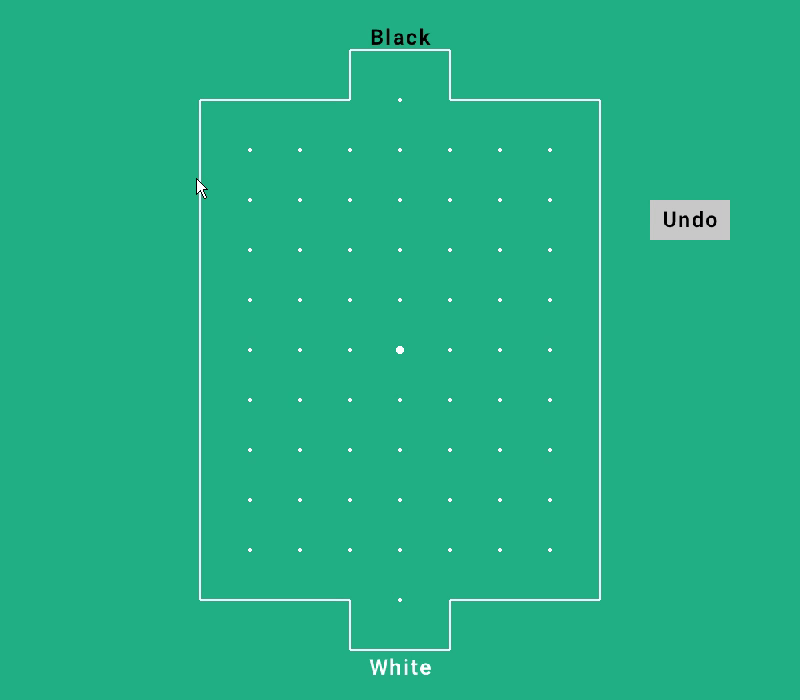

# Soccer paper game

Soccer paper game written in Raylib 

The game does not have an online mode so far, you play with yourself.

# Raylib 

Raylib is a simple and easy to use library to write videogames.

This library works on platform like Windows, Linux, macOS, Android and many more. 

# How to run and play the game

On Windows and Visual Studio Code is enough to download Raylib and install it.

<a href="https://www.raylib.com/" > Download from official website </a>

For the others platform, is official quide how to properly configure Raylib.

<a href="https://github.com/raysan5/raylib" > Quide on github </a>

